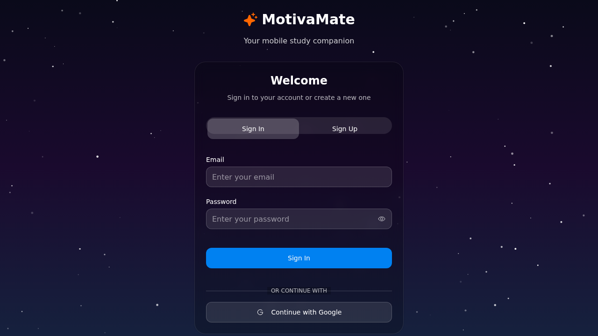

# MotivaMate Mobile App - UI/UX Summary for Development

This document provides a concise overview of the MotivaMate study partner mobile application's UI/UX design and functionality, suitable for requesting similar mobile app development from agents.

## 🎯 App Overview

**MotivaMate** is a comprehensive study companion mobile app that combines:
- Pomodoro-style study timers
- Task management with social challenges
- Progress tracking and gamification
- Calendar integration
- Achievement system
- Note-taking capabilities

## 📱 Key UI/UX Features Demonstrated

### 1. Visual Design Language

**Space Theme with Glass Morphism:**
- Animated starfield background creating an immersive cosmic atmosphere
- Semi-transparent cards with backdrop blur effects
- Deep teal primary color (#1A6B6B) with warm orange accents (#E67E22)
- Inter font family for optimal mobile readability

**Screenshot: Authentication Screen**


The authentication screen shows:
- Centered branding with app logo
- Clean tabbed interface (Sign In / Sign Up)
- Glass morphism card design with backdrop blur
- Space-themed animated background
- Mobile-optimized form fields
- Google OAuth integration button
- Consistent spacing and typography

### 2. Navigation Structure

**Bottom Tab Navigation (8 Tabs):**
1. **Achieve** 🎯 - Focus sessions and personal goals
2. **Tasks** ☑️ - Daily tasks and social challenges  
3. **Calendar** 📅 - Event management and study history
4. **Notes** 📝 - Note-taking and organization
5. **Profile** 👤 - Statistics and progress overview
6. **Awards** 🏆 - Achievement gallery and milestones
7. **Inspire** 💡 - Motivational content and quotes
8. **Test** 🧪 - Development tools and testing

### 3. Core Functionality Breakdown

#### Study Timer System
- **Pomodoro Integration**: 15/25/45/60 minute preset durations
- **Visual Progress**: Circular timer with animated progress ring
- **Subject Association**: Color-coded subject selection before sessions
- **Session Tracking**: Automatic logging of completed study time

#### Task Management
- **Daily Tasks**: Create tasks with priority levels (Low/Medium/High)
- **Social Challenges**: Multi-user competitions with leaderboards
- **Progress Visualization**: Daily completion percentages
- **Subject Integration**: Link tasks to specific study subjects

#### Progress Analytics
- **Multiple Chart Types**: Area, bar, and line charts for different metrics
- **Time Tracking**: Daily, weekly, and monthly study time trends
- **Streak Monitoring**: Consecutive day tracking with visual indicators
- **Subject Breakdown**: Time distribution across different subjects

#### Achievement System
- **20+ Unlockable Badges**: Time-based, session-based, and streak achievements
- **Progress Tracking**: Visual progress bars toward next milestones
- **Celebration Effects**: Confetti animations and haptic feedback
- **Categories**: Time, sessions, streaks, focus, goals, and tasks

#### Social Features
- **Challenge Creation**: Generate unique codes for sharing study challenges
- **Leaderboards**: Point-based ranking system for challenge participants
- **Real-time Updates**: Live progress tracking across all participants
- **Winner Recognition**: Celebration animations for challenge completion

### 4. Mobile-First Optimizations

#### Touch Interactions
- **44px Minimum Touch Targets**: Accessibility-compliant button sizes
- **Swipe Gestures**: Left/right swipes for tab navigation
- **Long Press Actions**: Advanced context menus for power users
- **Haptic Feedback**: Different vibration patterns for various actions

#### Device Adaptations
- **iOS Safe Areas**: Proper handling of notched devices
- **PWA Support**: Installable as native app on both iOS and Android
- **Offline Functionality**: Service worker for offline data access
- **Platform Detection**: Adaptive UI for iOS vs Android design patterns

#### Performance Features
- **Smooth Animations**: 60fps transitions with spring physics
- **Efficient Scrolling**: Momentum scrolling with optimized performance
- **Responsive Design**: Scales from mobile to tablet to desktop
- **Progressive Loading**: Skeleton screens and lazy loading

## 🔧 Technical Architecture

### Frontend Stack
- **React 19** with TypeScript for type safety
- **Tailwind CSS** for utility-first styling
- **Framer Motion** for smooth animations
- **Recharts** for data visualization
- **Vite** for fast development builds

### Backend Integration
- **Firebase Authentication** for secure user management
- **Cloud Firestore** for real-time data synchronization
- **Push Notifications** for achievement and reminder alerts
- **PWA Manifest** for native app installation

### State Management
- **React Context** for global application state
- **Custom Hooks** for Firebase data synchronization
- **Local Storage** for offline data persistence
- **Error Boundaries** for graceful error handling

## 🎨 Design System Components

### Color Palette
```css
Primary: #1A6B6B (Deep Teal)
Secondary: #E5E7EB (Light Blue-Gray)  
Accent: #E67E22 (Warm Orange)
Background: Space theme with animated stars
Cards: Semi-transparent black with backdrop blur
```

### Typography Scale
```css
H1: Inter Bold 24px (App Title)
H2: Inter SemiBold 20px (Section Headers)
H3: Inter Medium 18px (Card Titles)
Body: Inter Regular 16px (Main Text)
Caption: Inter Medium 14px (Timer, Stats)
```

### Component Specifications
- **Border Radius**: 8px for buttons, 12px for cards
- **Spacing Scale**: 4/8/16/24px consistent throughout
- **Animation Duration**: 200-300ms for micro-interactions
- **Shadow System**: Layered shadows for depth perception

## 📊 Data Models & Features

### Core Entities
- **Users**: Authentication, preferences, profile data
- **Subjects**: Study topics with color coding and time targets
- **StudySessions**: Timed sessions with duration and completion tracking
- **Tasks**: Daily tasks with priority, due dates, and completion status
- **Achievements**: Unlockable milestones with progress tracking
- **Challenges**: Social study competitions with leaderboards
- **Goals**: Personal objectives with deadlines and tracking
- **CalendarEvents**: Study events, exams, and reminders

### Real-time Features
- **Live Synchronization**: Cross-device data sync via Firebase
- **Offline Support**: Local storage with background sync
- **Push Notifications**: Achievement unlocks, reminders, challenge updates
- **Collaboration**: Real-time challenge progress sharing

## 🚀 Development Recommendations

### For Similar Mobile App Creation

1. **Start with Core Timer**: Implement Pomodoro timer as the foundation feature
2. **Progressive Enhancement**: Add features incrementally (subjects → tasks → social features)
3. **Mobile-First Design**: Prioritize touch interactions and responsive layouts
4. **Gamification Elements**: Include achievement system for user engagement
5. **Offline Capability**: Ensure app works without internet connection
6. **Platform Optimization**: Adapt UI patterns for iOS vs Android users
7. **Performance Focus**: Maintain 60fps animations and smooth scrolling
8. **Accessibility Compliance**: Follow WCAG guidelines for inclusive design

### Key User Flows to Implement

1. **Onboarding**: Authentication → Subject setup → First timer session
2. **Daily Usage**: Select subject → Start timer → Complete session → View progress
3. **Task Management**: Add tasks → Set priorities → Complete throughout day
4. **Social Challenges**: Create/join challenges → Complete tasks → View leaderboard
5. **Achievement Tracking**: Automatic progress → Unlock celebrations → Gallery view

This UI/UX documentation provides the essential information needed to recreate the MotivaMate study companion experience for mobile platforms, focusing on the core functionality, design system, and user experience patterns that make the app engaging and effective for students.